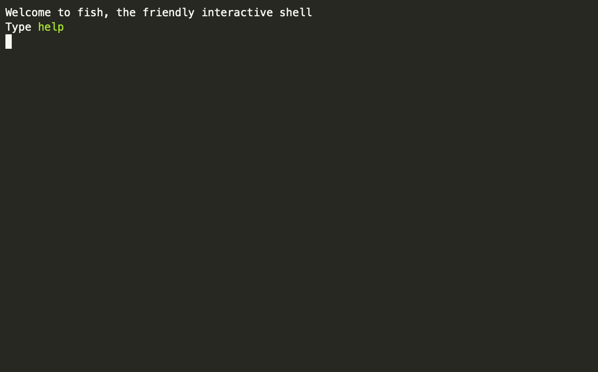

  

    


  

# java-ssl-tools (jssl)

Install, ping and uninstall certificates in java keystore.




## How to install

Just run: 
```
curl -sL https://raw.githubusercontent.com/pmamico/java-ssl-tools/main/install.sh | bash
```
on Windows, use `Git Bash` or bash enabled `Powershell` as system administrator.


### Requirements

* `JAVA_HOME` environment
* `openssl`
    
## Manual
```
jssl v1.2
Install trusted certificate and check SSL handshake against java keystore.
Usage: jssl <host> <operation> [-p|--port <arg>] [-a|--alias <arg>] [-h|--help] [-v|--version]
	<host>: without https:// and port, eg. google.com
	<operation>: ping, install or uninstall
	-p, --port: port (default: '443')
	-a, --alias: alias in keystore (default: '<host>')
	-h, --help: Prints help
	-v, --version: Prints version
```

## Why not just use `keytool`?
Java has a built-in `keytool` to handle certificates on the java keystore.  
However it has a few drawbacks:
### In `keytool` there is no way to check that the certifiacate works 
With `jssl` just type
```
$ jssl <URL> ping
```
### With `keytool` you have to type a lot!
 Especially annoying if you are in flow.  
First you need to get the certificate somehow,   
then to import it with keytool, thinking about alias names and the default password.  
Eg.:
```
$ echo | openssl s_client -connect "<URL>:443"  2>/dev/null | openssl x509 > certificate.pem
$ /opt/homebrew/opt/openjdk@11/bin/keytool -importcert -cacerts -noprompt -alias <myalias> -file certificate.pem -keypass changeit -storepass changeit
```
is equivalent to 
```
$ jssl <URL> install
```
